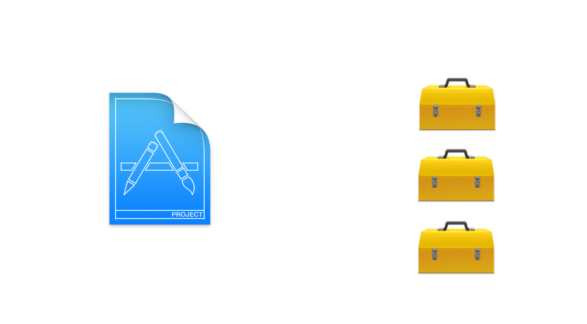
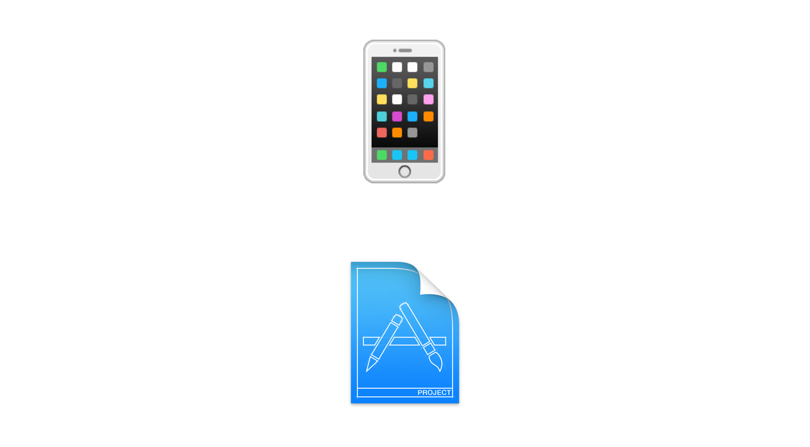
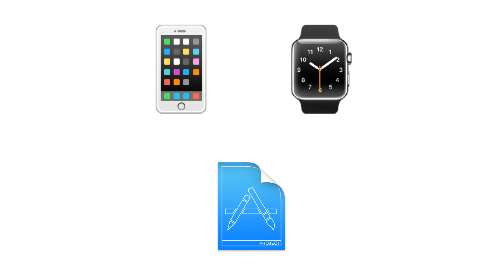
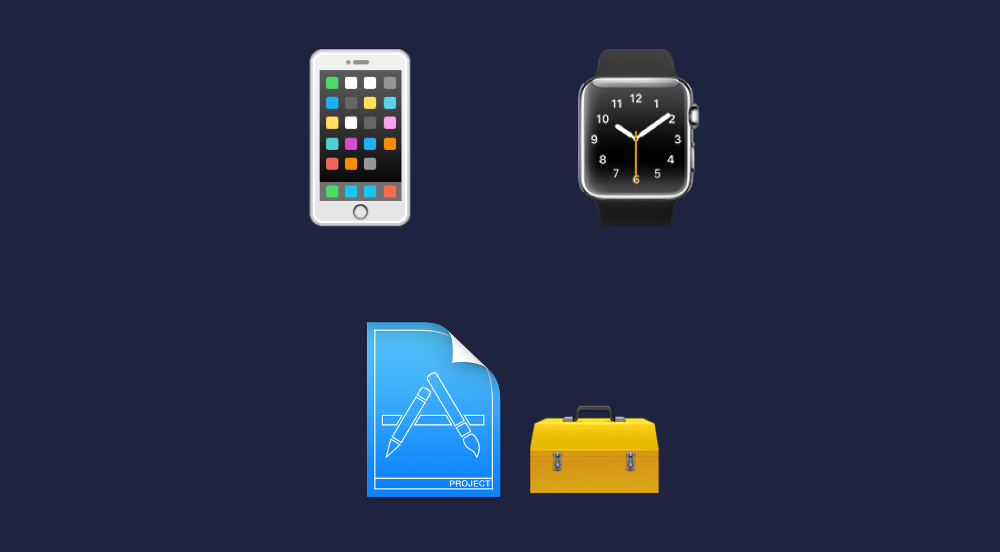
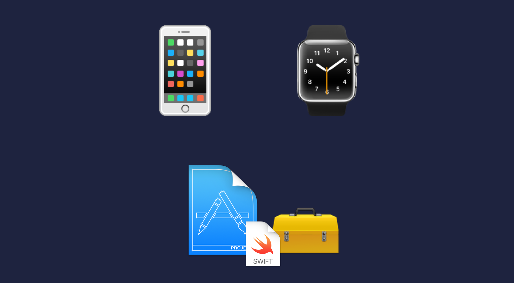
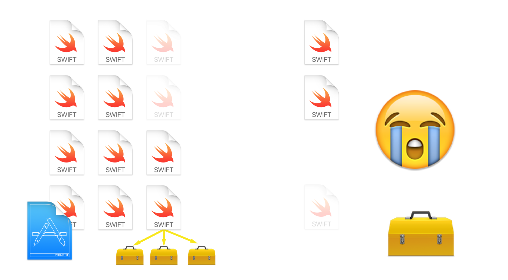
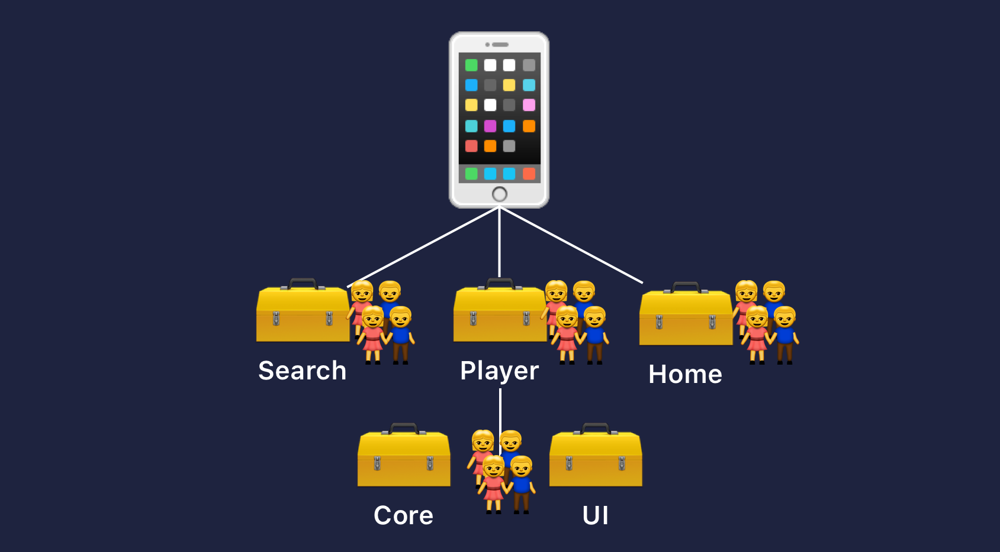
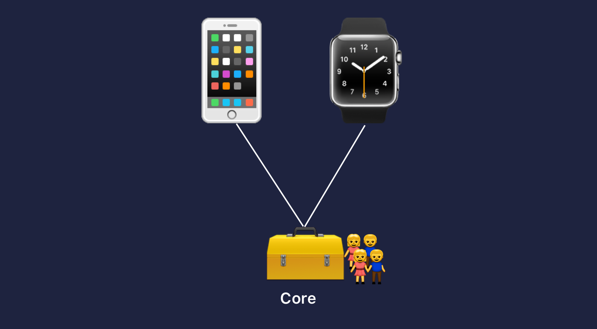

## Framework Oriented Programming
#### _@pepibumur_ / _pepibumur@gmail.com_

---

## Hi! :wave:
# __Pedro__

### iOS Developer at _SoundCloud_
### _@pepibumur_
### _Twitter/GitHub_
#### [www.ppinera.es](http://www.ppinera.es)

---

# Framework Oriented Programming

---

## Context
## _How_
## Tips
## _Downsides_

---


^ I would like to start this talk with a very simple question.
^ How many of you know what that thing is?

---

# _Box_
^ The answer is as simple as the question.
^ It's a box

---

## _Things with something_
## in common

^ We use boxes in our lives to collect/save things that have something in common.

---

# 💌📷📔🗒

^ Some examples of these things could be love letters, photos, diaries, notes.

---


^ However we're developers, we don't work with these sort of things.
^ You don't code love letters, or save photos in code.

---


^ In a daily basis we work with source code.
^ Headers, body files, Swift files.
^ Any kind of file that represents business logic written in any language.

---

## ~~Boxes~~
## _Frameworks_

^ Our boxes, where we save the source code and things that have something in common are Frameworks.

---


In computer science, a framework is a _collection_ of implementations of _behavior_, written in terms of a _language_, that has a _well-defined interface_ by which the behavior is invoked
__Wikipedia__

---

# External
# _Frameworks_

^ We usually use them from external sources.
^ We use tools, known as dependency managers that are responsible of resolving the dependencies tree and provide you with these framework that you can link from your app.

---



^ Rubygems and NPM are two examples of dependency managers for the Ruby and the Javascript community.
^ If you're a Cocoa developer the most used dependency tools in the community are CocoaPods and Carthage.

---

## _Saving time 👍_
### with others code

^ By using these external frameworks you save a lot of time coding.
^ When networking APIs were complex on the iOS world libraries like AFNetworking helped a lot.
^ As developers we're told to reuse code and optimize our time. Why writing something that has already been written by other developer in the community?

---

## _Contributing 👍_
### with the community

^ Creating external frameworks we contribute with the community.
^ We invest time and resources in implementing a reusable piece of code and offer and maintain it for other developers teams that might be interested in using that component that you developed.


---

## _Maintainability_
## _costs 👎_
### features and issues

^ Contributing with the community implies some costs.
^ A library is something that you have to maintain. Issues might arise, or features might be requested.
^ It's up to you to continue developing the library actively or encourage the community to do it.

---

```ruby
inhibit_all_warnings!
use_frameworks!

target 'MyApp' do
  pod "PureLayout"
  pod 'FLEX'
  pod 'DateTools'
  pod 'Reachability'
  pod 'RxSwift'
  pod 'SDWebImage'
  pod "SDVersion"
  pod 'BlocksKit'
  pod 'CTFeedback'
  pod 'TOWebViewController'
  pod '1PasswordExtension'
  pod 'SlackTextViewController'
  pod 'FeedbackMe'
  pod 'Localize-Swift'
  pod 'Smooch'
  pod 'Fabric'
  pod 'Crashlytics'
  pod 'CWStatusBarNotification'
  pod "ImagePickerSheetController"
  pod 'KYNavigationProgress'
end
```

^ This is an example of a Podfile where we specify all the external dependencies that we want to link our app against to.

---

### :apple:
## _1 Project_
### +
## X External frameworks

^ Most of projects nowadays are based on one target with multiple external dependencies.

---

## _Simple_
## _projects_


^ That setup works pretty well for simple projects, like pet projects, or projects that are giving their first steps.
^ We save a lot of time with reusing components that others wrote before.

---

## Only _1-2 platforms_<br><br>
# 🖥 :iphone:

^ It also works well if we don't have a lot of platforms, in that case we can easily share the source code by copying the source files to multiple targets.

---

## _Small_ teams
### __(and not distributed)__<br><br>

^ The setup is perfect for small and not distributed teams. The small team works in a monolithic project and since it's not big the number of conflicts is very small.

---

# :apple:

^ Big change in the market from Apple
^ Introduced new members to the family.

---

## _New_ platforms <br><br>
## 🖥📱⌚️📺

^ Currently 4 platforms
^ More coming

---



---



---



---



---


---


---


---


---


---



---

## _~~Simple~~_ complex
## _projects_


---

## Couldn't
## _reuse code_
## _scale easily_

---

## Bigger projects
## _Bigger teams_
### __(and also distributed)__

---

# _Conflicts_
## Between teams
### __(Interdependencies)__

---

# ~~🤗~~  😰


---

# 🤔

---

## _Framework Oriented Programming_


---

## __Architectural Approach__<br>

### Modularizing your apps code bases in _local_ and _multiplatform_ frameworks that expose a _hookable_ interface.

---

### New platforms/targets
## _Working only in_
# _UI_

---

# _Atomic teams_
## that own frameworks

---

## __Reuse__
## Business Logic

---

### Decide about _persistence_
### Decide about _patterns_
### Decide about _architecture_
### Decide about _language_

---

### Framework
## Exposes an _API_

---

#  < API > 

---

### Fewer _interdependencies_
### Fewer _conflicts_
### Fewer _regressions_

---

## _How to_
### _Setup the project_


---

## Using CocoaPods

---

```ruby
abstract_target 'Frameworks' do
  pod "Core", :path => "Frameworks/Core"
  pod "UI", :path => "Frameworks/UI"
  pod "Player", :path => "Frameworks/Player"
  pod "Offline", :path => "Frameworks/Offline"

  # Platforms
  target "MyApp"
  target "MyTVApp"
  target "MyWatchApp"
end
```

---

## _Manually_
### Creating/Linking

---

## _Workspace_
### Multiple framework projects
#### Linked/Embedded

---

## Multi-Platform Framework

```bash
# Supported platforms
SUPPORTED_PLATFORMS = iphoneos iphonesimulator appletvsimulator appletvos macosx watchsimulator watchos

# Valid architectures
VALID_ARCHS[sdk=macosx*] = x86_64
VALID_ARCHS[sdk=iphone*] = arm64 armv7 armv7s

# Frameworks Search Path
LD_RUNPATH_SEARCH_PATHS[sdk=iphone*] = $(inherited) @executable_path/Frameworks @loader_path/Frameworks
LD_RUNPATH_SEARCH_PATHS[sdk=macosx*] = $(inherited) @executable_path/../Frameworks @loader_path/../Frameworks
LD_RUNPATH_SEARCH_PATHS[sdk=watch*]   = $(inherited) @executable_path/Frameworks @loader_path/Frameworks
LD_RUNPATH_SEARCH_PATHS[sdk=appletv*] = $(inherited) @executable_path/Frameworks @loader_path/Frameworks
```

---

## _Recommendations_
### _(And downsides)_


---

## _Minimize_
### External dependencies
#### __(Do it by yourself)__

---

### How frameworks are _linked_?
### Should a framework be _embedded_?
### Can I link it _statically_?

---

## _Analyze_
### Existing tools __(e.g. CocoaPods)__

---

## _Find the setup_
### that works for you

---

## Freelance


---

## Feature Teams



---

## Multi-Platform apps



---

## _Simplicity_
### and clarity

---

## Define a public contract
### _and communication patterns_
^For example if it's objective-c, interfaces should be Objective-C compatible.

---

## Versioning
### _+ monorepository_

^Keep all the frameworks in the same repository.
^Version only if there's another project reusing the framework.

---

## _Documentation_
### Not good enough

---

# _Xcode_
## Has a long way to go
### 🙏 :apple:

^ Error forwarding
^ Frameworks recompilation

---

# Reference

- [frameworkoriented.io](frameworkoriented.io)
- [Building Modern Frameworks](https://developer.apple.com/videos/play/wwdc2014/416/)
- [How to create a Framework for iOS](https://www.raywenderlich.com/65964/create-a-framework-for-ios)
- [Framework vs Library](http://www.knowstack.com/framework-vs-library-cocoa-ios/)
- [Static and Dynamic libraries](https://pewpewthespells.com/blog/static_and_dynamic_libraries.html)
- [The Unofficial Guide to xcconfig files](https://pewpewthespells.com/blog/xcconfig_guide.html)

---

# Thanks
## _Questions?_


##### _Photos from_ [_Unsplash_](https://unsplash.com)
#### _Slides_ [_bit.ly/framework-oriented_](http://bit.ly/framework-oriented)

---
