## Framework Oriented _Programming_
#### **Pedro Piñera @pepibumur** - iOS Developer at SoundCloud
#### NSBudapest
### :watch::iphone::computer::tv:


---

# Sziasztok! :wave:
## __Pedro__

### iOS Developer at _SoundCloud_
### _@pepibumur_
### _Twitter/Facebook/~~Youtube~~_
#### [www.ppinera.es](http://www.ppinera.es)

---

### Context

#### **Before 2008**
## OSX - _1 Target_ :package:


---

### Context

#### **2008**
### :apple: launches iPhone Software Development Kit :iphone:
#### __(Developers move to iOS. New platform, frameworks,... New exciting area)__


---

### Context
#### **After 2008**
## :iphone: - *1 Target* :package:
## :computer: - *1 Target*:package:

---

### Context
#### **2011**
## CocoaPods released
#### **Dependency Resolving + Integration + Community :tada:**


---

### Context
#### **After 2011**
## :iphone: - *1 Target* :package:
## :computer: - *1 Target* :package:
### X Targets (External) :package::package:

---

### Context
#### **2015**

# :watch: :tv:


---


---

### Context
#### **2015**
### :iphone: - *1 Target*
### :computer: - *1 Target*
### :tv: - *1 Target*
### :watch: - *1 Target*

---

## How to reuse code?
#### (across platforms)

## **Frameworks** :package:


---

# Swift :heart:
## Dynamic Frameworks

---

## Embedded resources
### *(images, fonts, ...)*

---

## Dynamically linked
### *(No duplicated symbols)*

---

## Swift code

---

## Framework Oriented Programming
#### __Reusable & platform independent code__

#### [GitHub](https://github.com/pepibumur/framework-oriented-programming)

---

## Best practices
## _Principles_
## Advices
## _Examples_


---

# Frameworks Stack
### __SoundCloud Approach__


^ Before: Before starting with the first principle I'd like to show you the stack approach that we are trying at SoundCloud.
^ Broken line frameworks are those that are accessed by all frameworks of the stack. I'll explain later on what they are for.
^ Low: In the low level we find three frameworks that we generally find in most of the apps, one for networking that includes the wrapper around NSURLSession and the models. Another wrapper for persistency that includes the wrapper around Realm/CoreData and the models. We can also include here another persistency solutions such as Keychain, NSFileManager or NSUserDefaults. And another framework for analytics.
^ Middle: In the middle we find the Kit framework that is responsible of the business logic combining the frameworks from the frameworks below. We can have a big Kit for the whole app, or kits per feature.
^ Side: On the side we have one Framework with design related stuff such as Fonts, Colors...
^ Top: And on top of all of them we have different targets for each platform.
^ Multiplatform: All these frameworks are multiplatform, which means we have to pay attention when designing them since they shouldn't use any component that is tied to an specific platform. For example UIColor or NSFont that are part of UIKit and AppKit respectively.
^ SoundCloud: This was our approach but not the only one. I'll use it as a reference to go with you through the principles.

---

# Principles
### __Some theory__ :book:


---

# 1. Single Responsibility
## _SOLID inspired_


^ Inspired: The first principle is SOLID inspired.
^ Our frameworks should have a single responsibility and we must ensure it from the beginning.
^ Keep these responsibility boundaries always in mind when working with your frameworks.
^ Thus Networking should be responsible of offering the API access layer and defining the response models.
^ If our API is an authenticated API the authentication flow could be also part of it.

---

# 1. Single Responsibility
## _SOLID inspired_


^ The responsibility of persistence for example would be including the access layer to CoreData and the models. The Keychain access layer could also be part of this Framework and later on we could extract it out to its own Framework.

---

# 1. Single Responsibility
## _Start from a high level_


^ My recommendation is that you should start from a high level such as the examples I showed on the slides.
^ Let's take Persistence as an example. Initially we have a framework that includes all the persistency wrappers in the same place and also the models.

---

# 1. Single Responsibility
## _Slice them progressively_


^ We might find interesting to extract our application specific stuff into its own Framework (models) and separate them from the wrappers. That new framework could be use in a different project since it's not tied to your platform anymore.

---

# 1. Single Responsibility
## _Slice them progressively_
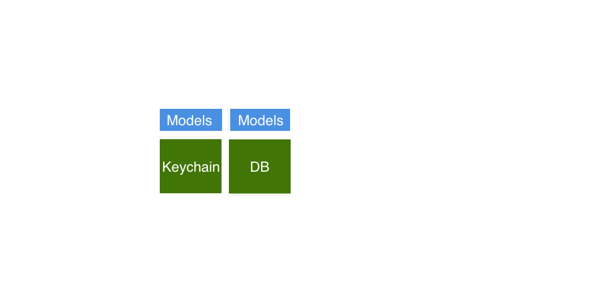

^ Another step further could be just splitting the persistence solutions. For example have a Framework only for the database, and another one only for Keychain. Why not?

---

# 2. Vertical dependencies
## _(Over Horizontal)_
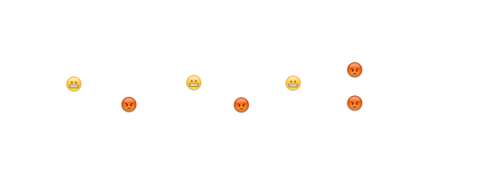

^ The second principle states that dependencies should be vertical.
^ We want to have more cohesion between layers avoiding coupling between elements in the same layer.
^ For example, Networking shouldn't know anything about how to persist data, or persistence shouldn't know anything about where the data comes from.
^ Elements in the same layer shouldn't know about each other but about the frameworks in the layer below.

---

# 3. _Lower_ in the stack
## _Fewer_ external dependencies


^ The third principle states that the number of external dependencies should increase as we go higher in the stack.
^ The reason is that dependencies of low levels are also dependencies of the upper levels.
^ Ideally you should avoid external dependencies as much as possible. But if you cannot try to respect this principle.

---

# 4. _One Step_ Dependencies
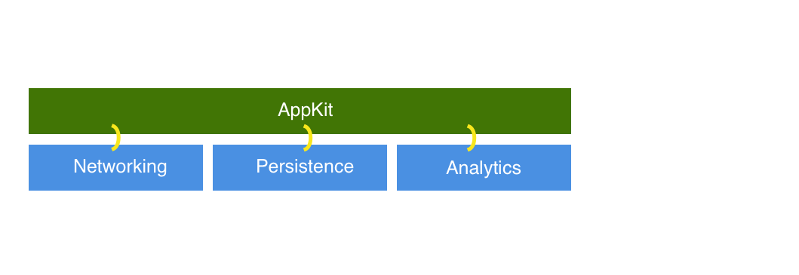

^ The fourth principle states that the dependencies should be only one step down but no more.
^ In this example AppKit dependencies are one level below itself which would satisfy the principle.

---

# 4. _One Step_ Dependencies


^ But for example iOS shouldn't know anything about Networking/Persistence/Analytics
^ This would make replacement easier and the frameworks less coupled.

---

# 5. _Internal_ by default
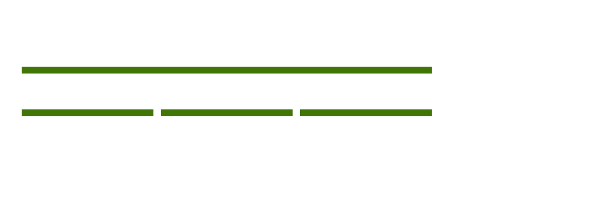

^ Components should be internal by default.
^ You don't have to actually do anything if you use Swift since that's the default.
^ Limit what can be accessed. Restrict the freedom and make public only your framework API.
^ If you use Objective-C in Build Phases you can define which headers are public/project/private.

---

# 6. Final
## _SOLID inspired (open/closed)_


^ The sixth principle is the final principle.
^ It's based in the open/closed principle of SOLID.
^ Allow extension (open) but without modifying the implementation.
^ That said if a framework exposes a component Pedro

---

# 6. Final
## _SOLID inspired (open/closed)_


^ He can be extended with a lookNice method
^ Or a bePolice extension

---

# 6. Final
## _SOLID inspired (open/closed)_


^ But we could never change its implementation and make Pedro a Ghost

---

# 6. Final
## _SOLID inspired (open/closed)_

```swift
final class Person {
  let name: String
}

class Alien: Person { // Compiler complains
}
```

^ The way we can get this done is making our classes/methods final.
^ With that we block any possible extension that would change our base classes.

---

# 7. Framework _models_
### _Don't share frameworks' models upwards_


^ Each framework should expose publicly its own models and not share models from the frameworks below.
^ That way we prevent coupling upper levels with the levels below.

---

# 7. Framework _models_
### _Don't share frameworks' models upwards_

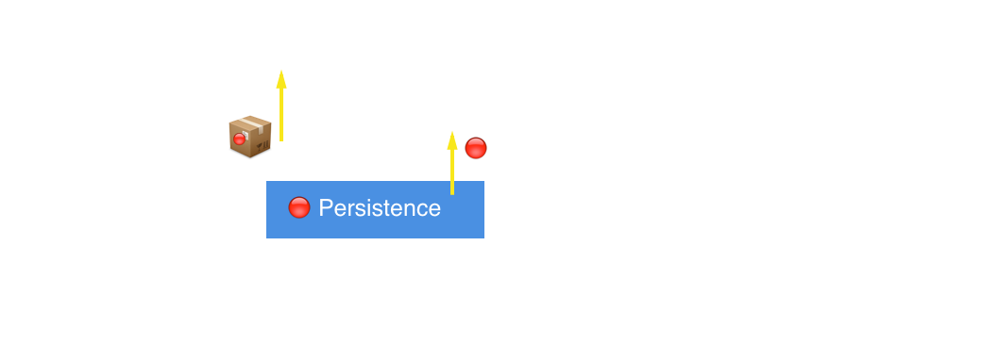

^ If we needed to expose a model up we should wrap them into a different object.
^ I'm going to give you a typical example.
^ Persistence exposes NSManagedObject models to AppKit.
^ From AppKit we don't want to expose this models app for two main reasons:
^ - We would be coupling the app to CoreData
^ - We would be using context dependent objects.
^ What we should instead is created value types, entities with the properties that are really needed.

---

# 7. Framework _models_
### _Don't share frameworks' models upwards_

```swift
// Persistence
class Author: NSManagedObjectModel {
  let name: String
}
class Track: NSManagedObjectModel {
  let author: Author
}

// ListenersKit
struct StreamTrackEntity {
  let name: String
  let authorName: String
}
```

---

# 7. Framework _models_
### _Don't share frameworks' models upwards_

```swift
struct StreamTrackEntityAdapter {
  func adapt(track: Track) -> StreamTrackEntity {
    return StreamTrackEntity(name: track.name, authorName: track.author.name)
  }
}
```

---

# 8. Platform _Abstraction_
## _SOLID inspired (DI)_


^ Make your Frameworks multiplatform.
^ Multiplatform frameworks are highlighted in the stack. Only the apps are the platform specific targets.

---

# 9. _Protocol_ Oriented Interfaces
## _SOLID inspired (DI)_

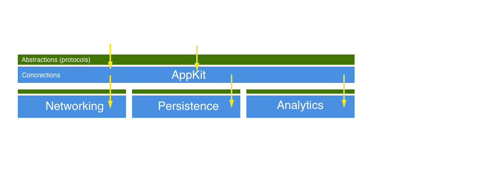

^ Frameworks public interfaces should be abstractions, protocols.
^ Why?
^ In the example you see like instead of relying on these abstraction layers, we rely on the concrections.

---

# 9. _Protocol_ Oriented Interfaces
## _SOLID inspired (DI)_


^ If someone updates the networking implementation.
^ We'll be forced to also update our Framework.

---

# 9. _Protocol_ Oriented Interfaces
## _SOLID inspired (DI)_


^ However, if we rely on these abstraction layers

---

# 9. _Protocol_ Oriented Interfaces
## _SOLID inspired (DI)_

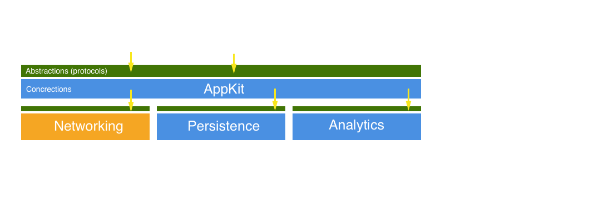

^ And someone decides to update the implementation.
^ We won't be affected and we don't have to update our AppKit.

---

# 9. _Protocol_ Oriented Interfaces
## _SOLID inspired (DI)_

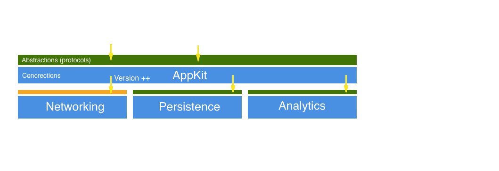

^ Only in that case when the abstraction layer is updated.
^ We'll be force to update our AppKit.
^ But that's mostly when there's a new version of the Framework.

---

# 10. Core/Testing
## _(aka your project Foundation frameworks)_


^ And the last one, have a core/testing framework.
^ They are the foundation of your project.
^ They are accessible from all the frameworks in the stack.
^ Testing for example should include any testing external library, helpers, fixtures and factories.

---

# 10. Core/Testing
## _(aka your project Foundation frameworks)_

- Extensions
- Logging
- Analytics
- Architectural components (e.g. Reactive)

^ Regarding Core it would include Foundation extensions, logging and analytics tools, as well as architectural components.
^ For example if you use Reactive Programming, you could offer the Reactive components form here.

---

# Advantages


---

# Multiplatform apps
## **Only working on the UI**
## :watch::iphone::tv::computer:


^ The first main advantage is that you can create multiple platform applications easily
^ Once you have the stack define giving support to a new platform is about creating the application layer.
^ Mostly the UI layer.

---

# Multiplatform apps
## **Only working on the UI**
## :watch::iphone::tv::computer:

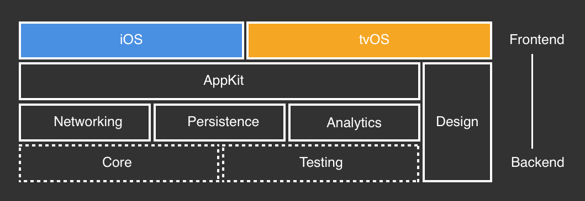

---

# Experimentation

- Prototyping
- Playgrounds

```swift
import MyAppKit
requestFactory.request(path: "/myPath/").subscribeNext { response in
  // yai!
}
```

^ More over you can experiment easily.
^ Wouldn't you enjoy importing your Frameworks in a Playground and executing API requests directly from there?

---

# New products
## **With similar core needs**
### *Because you want to reuse code, right?*

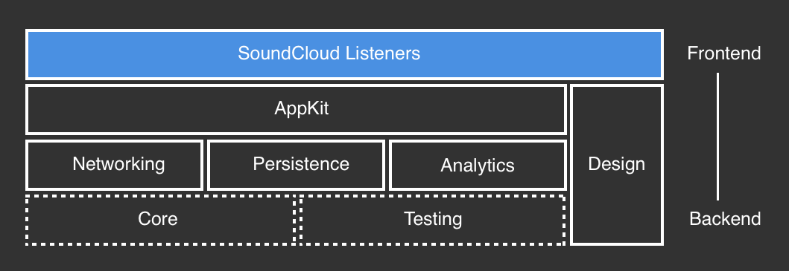

^ This setup is also great for creating new products that share similar core needs.
^ In SoundCloud we have the listeners app that is the one you find on the Store as SoundCloud.
^ But we also have a SoundCloud for creators app that we had to build using React Native.
^ Sadly from the iOS team because we couldn't offer them any reusable component.

---

# New products
## **With similar core needs**
### *Because you want to reuse code, right?*


^ Your reusable Frameworks can also be open sourced.
^ Your project or company could benefit form the community contributions.
^ Let's say we build a wrapper around CoreData. We could separate our application related components and offer the wrapper in open as other companies are doing.

---

# Open Source
## **And benefit from the community**
### *Build pieces of code that you'd be proud of open sourcing*

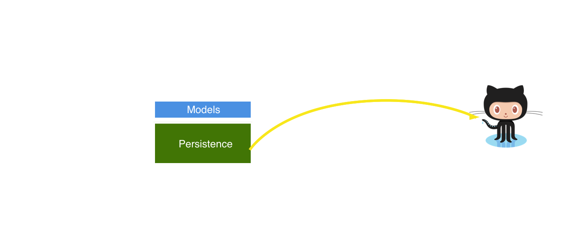

^ You could have specialized teams focused in some framewors.
^ If your team is not big enough you could have a team working in the whole app.
^ But as soon as your team grows you could split responsibilities.

---

# Specialized teams
## **From UI lovers to Core Data experts**
### _(clearly defined team boundaries)_


^ Having people working on the UI layer.
^ And some others working closer to the backend of the app.

---

# Specialized teams
## **From UI lovers to Core Data experts**
### _(clearly defined team boundaries)_


---


# How to?  🤔
### **There are multiple options**
#### (I'll show you some)


---

# **CocoaPods**

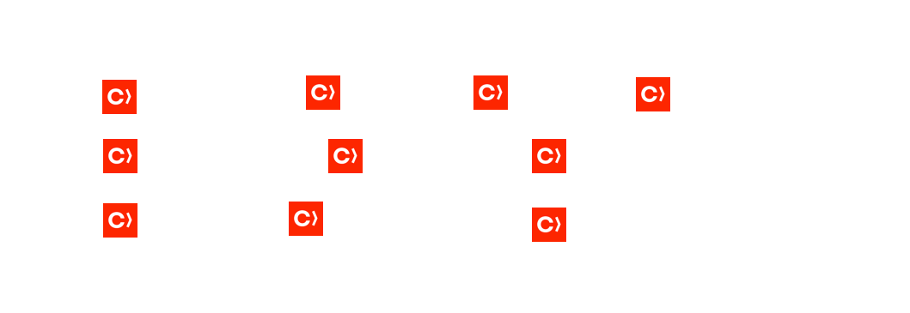

---

# **CocoaPods**

- ✅ Easy setup (each Framework `.podspec`)
- ✅ Same setup for local/external dependencies
- ❌ It sucks if you don't version
- ❌ Fully frameworks approach *(load time)*

---

# **Manual**

- ✅ More control over the workspace
- ✅ Custom setup *(you design it)*
- ❌ Cumbersome setup *(Build Settings)*

> External dependencies can be checked out with Carthage/Git Submodules

---

# XCConfig
### *And making your Framework multiplatform*

---

```bash
SUPPORTED_PLATFORMS        = iphoneos iphonesimulator appletvsimulator appletvos macosx watchsimulator watchos

TARGETED_DEVICE_FAMILY[sdk=iphone*] = 1,2
TARGETED_DEVICE_FAMILY[sdk=watch*]   = 4
TARGETED_DEVICE_FAMILY[sdk=appletv*] = 3

VALID_ARCHS[sdk=macosx*] = x86_64

LD_RUNPATH_SEARCH_PATHS[sdk=iphone*] = $(inherited) @executable_path/Frameworks @loader_path/Frameworks
LD_RUNPATH_SEARCH_PATHS[sdk=macosx*] = $(inherited) @executable_path/../Frameworks @loader_path/../Frameworks
LD_RUNPATH_SEARCH_PATHS[sdk=watch*]   = $(inherited) @executable_path/Frameworks @loader_path/Frameworks
LD_RUNPATH_SEARCH_PATHS[sdk=appletv*] = $(inherited) @executable_path/Frameworks @loader_path/Frameworks
```

---

# **Hybrid**


---

# **Hybrid**

- ✅ *CocoaPods* resolves/integrates app dependencies
- ✅ *Carthage* resolves frameworks dependencies
- ✅ Custom stack setup

---

# Open Questions


---

## Versioning?
### _Git repo per framework?_

---

1. Keep it in the same repository *(fast iterations)*
2. Move it once it consolidates *(sporadic changes)*
3. Then version it! *(snapshots in time)*

---

## External dependencies?
### _How to fetch them?_

---

- _If CocoaPods for local:_ Use it also for external
- _If manual setup:_ Use Carthage or Git Submodules

---

## Static or Dynamic?
### :package:

---

- _Objective-C_ & not shared - **Static**
- _Objective-C_ && shared - **Dynamic**
- _Swift_ - **Dynamic**

---

## How many _dynamic_ frameworks?
### _The more, the worse loading time_
#### _Will :apple: improve it?_ 🤔

---

- No more than 6 - [(WWDC2016:406)](https://developer.apple.com/videos/play/wwdc2016/406/)
- Group dependencies in Framework *(Manual setup)*

```swift
Testing.framework
    Quick.{swift,h,m}
    Nimble.{swift,h,m}
    OHHTTPStubs.{swift,h,m}
Core.framework
    RxSwift{.swift}
```

---

# Downsides :pensive:


---

## Lack of documentation
### _(Targets Configuration)_
####  __Tip: Use CocoaPods and copy the configuration__

^ Unless you have played a lot with Build Settings it's not a straightforward process.
^ You'll get some errors, missing symbols, unrecognized components and you don't know why.
^ If you know about it, go ahead with a manual process.
^ If you don't there's a trick which is based on using CocoaPods.

---

## Storyboards/Xibs in Frameworks
### __Sucks 😥__
#### Tip: Keep them in the application target

---

## Frameworks code recognition
### __Sucks even more 😭__

---

## Some external dependencies
### Are distributed as *Platform Binaries*

---

```bash
## XCConfig
LD_RUNPATH_SEARCH_PATHS[sdk=macosx*] = $(inherited) Fabric/OSX
LD_RUNPATH_SEARCH_PATHS[sdk=appletv*] = $(inherited) Fabric/tvOS
LD_RUNPATH_SEARCH_PATHS[sdk=iphone*] = $(inherited) Fabric/iOS
```

---

### Some even don't provide
## *binaries for all the platforms*

---

## Proxy them using *Macros*

---

## Macros!

```swift
#if !os(watchOS)
  import Fabric
#end

def log(message: String) {
  #if !os(watchOS)
    // Log using Fabric
  #end
}
```

---

## *APIs*
### Might differ between platforms

---

- *NSFetchedResultsController* not for macOS
- *NSIndexPath* for watchOS has no row/section

---

## _Proxy them_
### Also using macros!

---

# Conclusions


---

## **Very time-saver**
### *for multi-platform projects*

---

##  Aims less coupled code
### **(defined boundaries)**
## :package:

---

## Setup requires some
### **Xcode Build Settings knowledge**
#### *(Unless you use CocoaPods)* 😬

---

### *Minimize* dependencies
# 6 dependencies
### _(KISS)_

---

## Use your *commonsense*
### When designing your stack

---

## Use your *commonsense*
### **Don't be a Javascript developer**
### :package::package::package::package::package::package::package::package::package::package::package:

---


## And remember
### _The stack depends on your needs_

---

### Is it a company or a freelance project?

---

### *Is it a company or a freelance project?*
### Is it a new project?

---

### *Is it a company or a freelance project?*
### *Is it a new project?*
### Am I using any dependencies tool?

---

### *Is it a company or a freelance project?*
### *Is it a new project?*
### *Am I using any dependencies tool?*
### How many people in the team?

---

# References

- [Library Oriented Programming: Justin Spahr-Summers](https://realm.io/news/justin-spahr-summers-library-oriented-programming/)
- [The Unofficial Guide to xcconfig files](https://pewpewthespells.com/blog/xcconfig_guide.html)
- [WWDC: Optimizing App Startup Time](https://developer.apple.com/videos/play/wwdc2016/406/)
- [Static & Dynamic libraries](https://pewpewthespells.com/blog/static_and_dynamic_libraries.html)
- [pepibumur/framework-oriented-programming](https://github.com/pepibumur/framework-oriented-programming)

---

# Credits
### :camera: from [Unsplash](http://unsplash.com)


---


---

# Szimpla
### __Network Testing in Swift__
#### github.com/pepibumur/szimpla


---

# __Köszönöm__ :grinning:
### Questions?
#### Slides (SpeakerDeck) - [http://bit.ly/29ekocn](http://bit.ly/29ekocn)
#### __pepibumur - pepibumur@gmail.com__


