# Framework Oriented _Programming_
#### **Pedro Piñera @pepibumur**
# :watch::iphone::computer::tv:

---

<!-- # __Hello__
## _It's me_
### _(From ~~the other side~~ London)_


--- -->

## __Pedro__

### iOS Developer at
### SoundCloud
### _@pepibumur_

---

# __Framework__ Oriented Programming
- Started with [**GitDo**](http://gitdo.io)
- Applying principles to [**SoundClound**](https://soundcloud.com)
- **Ideas/Principles** together in a repository *(Reference)*
- **Feedback** is welcome 💌

---

# Index

- Context
- Principles
- Advantages
- How to?
- Open Questions
- SoundCloud attempt
- Downsides
- Conclusions

---

# Index

- **Context**
- Principles
- Advantages
- How to?
- Open Questions
- SoundCloud attempt
- Downsides
- Conclusions

---

# Context

#### **Before 2008**
## OSX == **1 Bundle***
#### *_Xcode project target_

---

# Context

#### **2008**
## Apple launches iPhone Software Development Kit :iphone:
#### _(Developers move to iOS. New platform, frameworks,... New exciting area)_

---

# Context
#### **After 2008**
## iOS == **1 Bundle***
## OSX == **1 Bundle***
#### *_Xcode project target_

---

## 2011


---

# Context
#### **2011**
## CocoaPods released
#### *Dependency Resolving + Integration + Community :tada:*

---

# Context
#### **After 2011**
## iOS == **1 Bundle***
## OSX == **1 Bundle***
## X Bundles (External Dependencies)
#### *_Xcode project target_

---

# Context
#### **2015**

# :watch: :tv:

^ Something big took place.
^ Two new platforms to code for.

---

# OMG
## **That's**
## **Awesome**


^ That was very exciting. New development area

---

# Trying to
#  __reuse__ :cold_sweat:
## your code base


^ But when you tried to reuse your application logic
^ You **figure out** it was a big nightmare.

---

# Context
#### **2015**
## iOS == **1 Bundle***
## OSX == **1 Bundle***
## tvOS == **1 Bundle***
## watchOS == **1 Bundle***

^ What initially was only one bundle.
^ Turned into four bundles, one per platform.

---

# How to reuse code?
### _(across platforms)_

## **Frameworks**

^ The need of reusing logic came up.
^ How can we do it?
^ The answer is very simple.
^ Using **Frameworks**

---

# Swift :heart:
## **Dynamic Frameworks**
#### (OSX, iOS, watchOS, tvOS)

- Allow embedded resources *(images, fonts, ...)*
- Dynamically linked *(No duplicated symbols)*
- Swift code

^ Swiff made it easier thanks to Frameworks.
^ They allowed embedding resources such as images and fonts.
^ It also allowed linking them dynamically (avoiding duplicated symbols problems).
^ And having Swift code!

---

# Framework Oriented Programming
### **Coding your apps organizing your code base in reusable & multiplatform code bundles**

Best Practices, Principles, Advices..

[github.com/pepibumur/framework-oriented-programming](https://github.com/pepibumur/framework-oriented-programming)

^ Articles: If you do some research you can find some good articles and references about how to create Frameworks.
^ Reference: However, there's no good reference of how to design and organize them.
^ Companies: Some companies are already doing it but almost none of them share how they do it.
^ FOP: I experimented with it and created a reference with best practices, principles and advices.

---

# Index

- Context
- **Principles**
- Advantages
- How to?
- Open Questions
- SoundCloud attempt
- Downsides
- Conclusions

^ Let's dive into the principles

---

# Frameworks Stack
### __SoundCloud Approach__

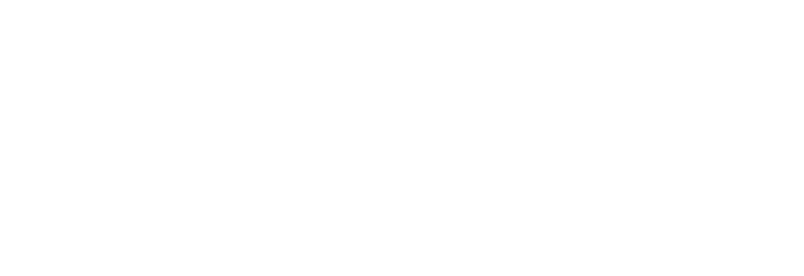

^ Before: Before starting with the first principle I'd like to show you the stack approach that we are trying at SoundCloud.
^ Broken line frameworks are those that are accessed by all frameworks of the stack. I'll explain later on what they are for.
^ Low: In the low level we find three frameworks that we generally find in most of the apps, one for networking that includes the wrapper around NSURLSession and the models. Another wrapper for persistency that includes the wrapper around Realm/CoreData and the models. We can also include here another persistency solutions such as Keychain, NSFileManager or NSUserDefaults. And another framework for analytics.
^ Middle: In the middle we find the Kit framework that is responsible of the business logic combining the frameworks from the frameworks below. We can have a big Kit for the whole app, or kits per feature.
^ Side: On the side we have one Framework with design related stuff such as Fonts, Colors...
^ Top: And on top of all of them we have different targets for each platform.
^ Multiplatform: All these frameworks are multiplatform, which means we have to pay attention when designing them since they shouldn't use any component that is tied to an specific platform. For example UIColor or NSFont that are part of UIKit and AppKit respectively.
^ SoundCloud: This was our approach but not the only one. I'll use it as a reference to go with you through the principles.

---

# 1. Single Responsibility
#### __SOLID inspired__
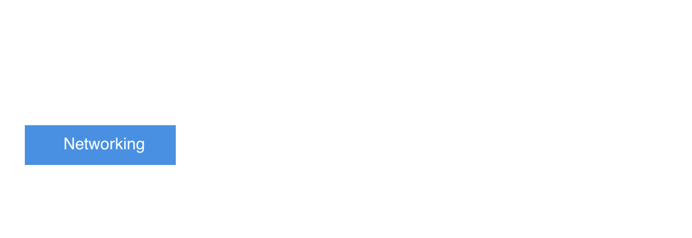

^ Inspired: The first principle is SOLID inspired.
^ Our frameworks should have a single responsibility and we must ensure it from the beginning.
^ Keep these responsibility boundaries always in mind when working with your frameworks.
^ Thus Networking should be responsible of offering the API access layer and defining the response models.
^ If our API is an authenticated API the authentication flow could be also part of it.

---

# 1. Single Responsibility
#### __SOLID inspired__


^ The responsibility of persistence for example would be including the access layer to CoreData and the models. The Keychain access layer could also be part of this Framework and later on we could extract it out to its own Framework.

---

# Responsibility?
### __CoreData access layer?__


^ Defining the responsibility is hard
^ It changes over time when your framework evolves.
^ A lot of questions might arise when defining when defining our Frameworks Responsibility.
^ Where should the CoreData Access layer be?

---

# Responsibility?
### __CoreData access layer?__
### __Storage access layer?__


^ Where should the Storage access layer be?

---

# Responsibility?
### __CoreData access layer?__
### __Storage access layer?__
### __Keychain access layer?__


^ What about Keychain?

---

# Responsibility?
### __CoreData access layer?__
### __Storage access layer?__
### __Keychain access layer?__
### __Models?__


^ And the models?

---

# Responsibility?
### __CoreData access layer?__
### __Storage access layer?__
### __Keychain access layer?__
### __Models?__
# 😩


^ It's not something easy to decide about.

---

# 1. Single Responsibility
## __Start from a high level__


^ My recommendation is that you should start from a high level such as the examples I showed on the slides.
^ Let's take Persistence as an example. Initially we have a framework that includes all the persistency wrappers in the same place and also the models.

---

# 1. Single Responsibility
## __Slice them progressively__
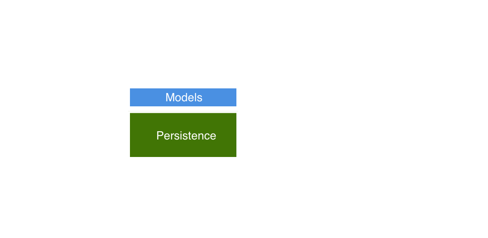

^ We might find interesting to extract our application specific stuff into its own Framework (models) and separate them from the wrappers. That new framework could be use in a different project since it's not tied to your platform anymore.

---

# 1. Single Responsibility
## __Slice them progressively__


^ Another step further could be just splitting the persistence solutions. For example have a Framework only for the database, and another one only for Keychain. Why not?

---

# 2. Vertical dependencies
## __(Over Horizontal)__


^ The second principle states that dependencies should be vertical.
^ We want to have more cohesion between layers avoiding coupling between elements in the same layer.
^ For example, Networking shouldn't know anything about how to persist data, or persistence shouldn't know anything about where the data comes from.
^ Elements in the same layer shouldn't know about each other but about the frameworks in the layer below.

---

# 3. __Lower__ in the stack
## __Fewer__ external dependencies

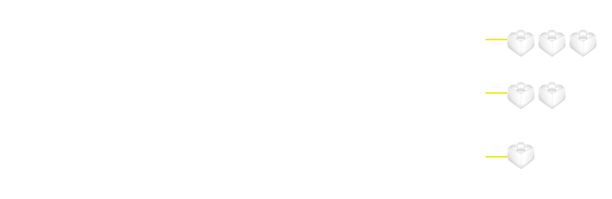

^ The third principle states that the number of external dependencies should increase as we go higher in the stack.
^ The reason is that dependencies of low levels are also dependencies of the upper levels.
^ Ideally you should avoid external dependencies as much as possible. But if you cannot try to respect this principle.

---

# 4. __One Step__ Dependencies


^ The fourth principle states that the dependencies should be only one step down but no more.
^ In this example AppKit dependencies are one level below itself which would satisfy the principle.

---

# 4. __One Step__ Dependencies
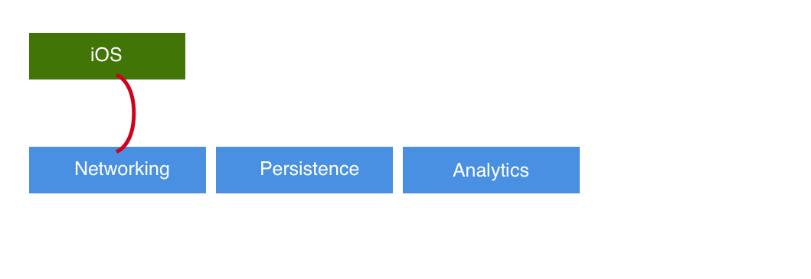

^ But for example iOS shouldn't know anything about Networking/Persistence/Analytics
^ This would make replacement easier and the frameworks less coupled.

---

# 5. __Internal__ by default


^ Components should be internal by default.
^ You don't have to actually do anything if you use Swift since that's the default.
^ Limit what can be accessed. Restrict the freedom and make public only your framework API.
^ If you use Objective-C in Build Phases you can define which headers are public/project/private.

---

# 6. Final
#### __SOLID inspired (open/closed)__

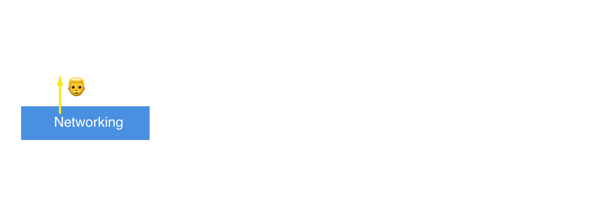

^ The sixth principle is the final principle.
^ It's based in the open/closed principle of SOLID.
^ Allow extension (open) but without modifying the implementation.
^ That said if a framework exposes a component Pedro

---

# 6. Final
#### __SOLID inspired (open/closed)__

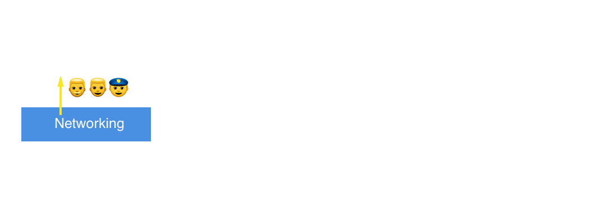

^ He can be extended with a lookNice method
^ Or a bePolice extension

---

# 6. Final
#### __SOLID inspired (open/closed)__


^ But we could never change its implementation and make Pedro a Ghost

---

# 6. Final
#### __SOLID inspired (open/closed)__

```swift
final class Person {
  let name: String
}

class Alien: Person { // Compiler complains
}
```

^ The way we can get this done is making our classes/methods final.
^ With that we block any possible extension that would change our base classes.

---

# 7. Framework __models__
### __Don't share lower frameworks models upwards__

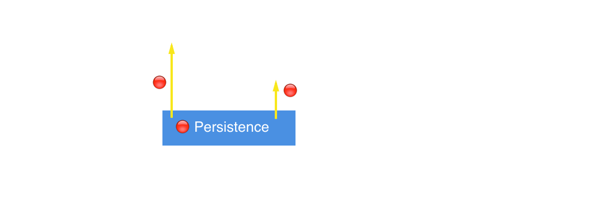

^ Each framework should expose publicly its own models and not share models from the frameworks below.
^ That way we prevent coupling upper levels with the levels below.

---


# 7. Framework __models__
### __Don't share lower frameworks models upwards__


^ If we needed to expose a model up we should wrap them into a different object.
^ I'm going to give you a typical example.
^ Persistence exposes NSManagedObject models to AppKit.
^ From AppKit we don't want to expose this models app for two main reasons:
^ - We would be coupling the app to CoreData
^ - We would be using context dependent objects.
^ What we should instead is created value types, entities with the properties that are really needed.

---

# 7. Framework __models__
### __Don't share lower frameworks models upwards__

```swift
// Persistence
class Author: NSManagedObjectModel {
  let name: String
}
class Track: NSManagedObjectModel {
  let author: Author
}

// ListenersKit
struct StreamTrackEntity {
  let name: String
  let authorName: String
}
```

---

# 7. Framework __models__
### __Don't share lower frameworks models upwards__

```swift
struct StreamTrackEntityAdapter {
  func adapt(track: Track) -> StreamTrackEntity {
    return StreamTrackEntity(name: track.name, authorName: track.author.name)
  }
}
```

---

# 8. Platform __Abstraction__
#### __SOLID inspired (DI)__


^ Make your Frameworks multiplatform.
^ Multiplatform frameworks are highlighted in the stack. Only the apps are the platform specific targets.

---

# __But...__
### _There's platform specific logic_
__Examples__
<br>
- No `NSFetchedResultsController` in macOS
- `NSIndexPath` is slightly different for watchOS.


^ But what if there's platform specific logic?

---

# 8. Platform __Abstraction__
## __Macros!__

```swift
#if os(OSX)
  // OSX logic
#else
  // Other platforms logic
#endif
```

^ You have Objective-C and Swift compilation macros where you decide which code should be included depending on the platform.

---

# 9. __Protocol__ Oriented Interfaces
#### __SOLID inspired (DI)__


^ Frameworks public interfaces should be abstractions, protocols.
^ Why?
^ In the example you see like instead of relying on these abstraction layers, we rely on the concrections.

---

# 9. __Protocol__ Oriented Interfaces
#### __SOLID inspired (DI)__

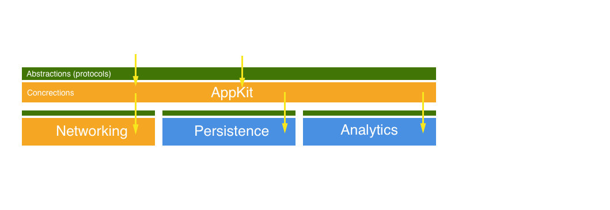

^ If someone updates the networking implementation.
^ We'll be forced to also update our Framework.

---

# 9. __Protocol__ Oriented Interfaces
#### __SOLID inspired (DI)__

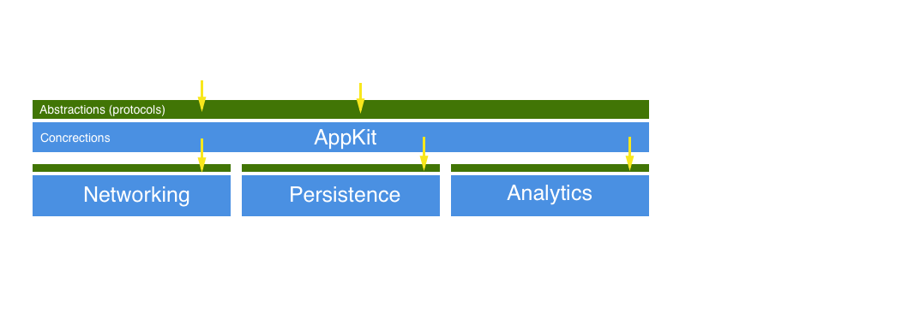

^ However, if we rely on these abstraction layers

---

# 9. __Protocol__ Oriented Interfaces
#### __SOLID inspired (DI)__


^ And someone decides to update the implementation.
^ We won't be affected and we don't have to update our AppKit.

---

# 9. __Protocol__ Oriented Interfaces
#### __SOLID inspired (DI)__


^ Only in that case when the abstraction layer is updated.
^ We'll be force to update our AppKit.
^ But that's mostly when there's a new version of the Framework.

---

# 10. Core/Testing
### __(aka your project Foundation frameworks)__

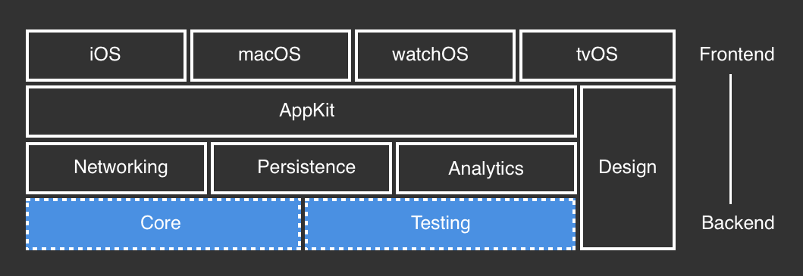

^ And the last one, have a core/testing framework.
^ They are the foundation of your project.
^ They are accessible from all the frameworks in the stack.
^ Testing for example should include any testing external library, helpers, fixtures and factories.

---

# 10. Core/Testing
### __Accessible from all the Frameworks__

- Extensions
- Logging
- Analytics
- Architectural components (e.g. Reactive)

^ Regarding Core it would include Foundation extensions, logging and analytics tools, as well as architectural components.
^ For example if you use Reactive Programming, you could offer the Reactive components form here.

---

# Index

- Context
- Principles
- **Advantages** 😋
- How to?
- Open Questions
- SoundCloud attempt
- Downsides
- Conclusions

---

# Multiplatform apps
## **Only working on the UI**
## :watch::iphone::tv::computer:

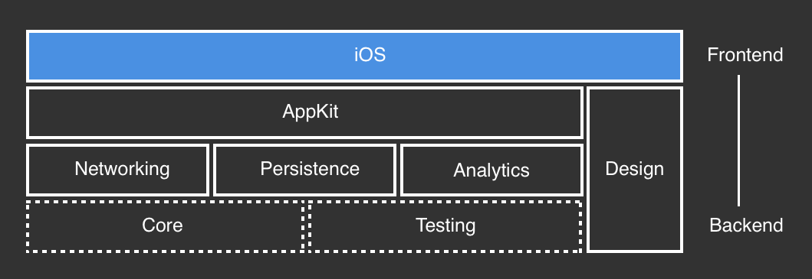

^ The first main advantage is that you can create multiple platform applications easily
^ Once you have the stack define giving support to a new platform is about creating the application layer.
^ Mostly the UI layer.

---

# Multiplatform apps
## **Only working on the UI**
## :watch::iphone::tv::computer:


---

# Experimentation
## **`import MyAppKit`**

- Prototyping
- Playgrounds

^ More over you can experiment easily.
^ Wouldn't you enjoy importing your Frameworks in a Playground and executing API requests directly from there?

---

# New products
## **With similar core needs**
### *Because you want to reuse code, right?*


^ This setup is also great for creating new products that share similar core needs.
^ In SoundCloud we have the listeners app that is the one you find on the Store as SoundCloud.
^ But we also have a SoundCloud for creators app that we had to build using React Native.
^ Sadly from the iOS team because we couldn't offer them any reusable component.

---

# New products
## **With similar core needs**
### *Because you want to reuse code, right?*

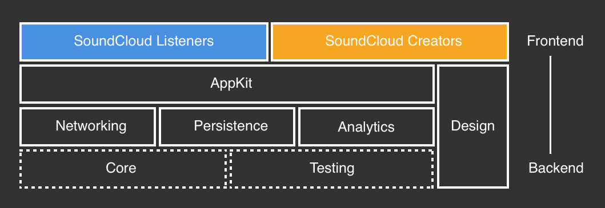

^ Your reusable Frameworks can also be open sourced.
^ Your project or company could benefit form the community contributions.
^ Let's say we build a wrapper around CoreData. We could separate our application related components and offer the wrapper in open as other companies are doing.

---

# Open Source
## **And benefit from the community**
### *Build pieces of code that you'd be proud of open sourcing*


^ You could have specialized teams focused in some framewors.
^ If your team is not big enough you could have a team working in the whole app.
^ But as soon as your team grows you could split responsibilities.

---

# Specialized teams
## **From UI lovers to Core Data experts**
### _(clearly defined team boundaries)_

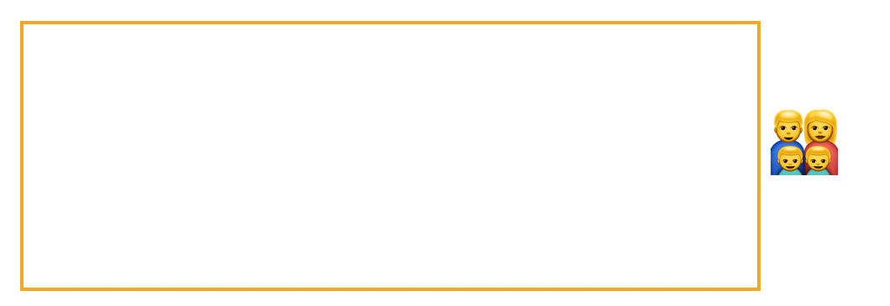

^ Having people working on the UI layer.
^ And some others working closer to the backend of the app.

---

# Specialized teams
## **From UI lovers to Core Data experts**
### _(clearly defined team boundaries)_


---


# Index

- Context
- Principles
- Advantages
- **How to?**
- Open Questions
- SoundCloud attempt
- Downsides
- Conclusions

---

# How to?
### **There are multiple options**
#### _(I'll show you some)_

---

# How to?
### **CocoaPods**


---

# How to?
### **CocoaPods**

- ✅ Easy setup (each Framework `.podspec`)
- ✅ You don't have to worry about Xcode Frameworks configuration
- ✅ Same setup for local/external dependencies
- ❌ `.podspec` cannot point to another local `.podspec`s
- ❌ It sucks if you don't version.

---

# How to?
### **Local podspec discovery**

```ruby
# Networking ~> Core dependency not found
pod 'Networking'
pod 'Core'
pod 'AppKit'
```

---

# How to?
### **Local podspec discovery**

```ruby
pod 'Core'
pod 'Networking' # Core has already been resolved
pod 'AppKit'
```

---

# How to?
### **Manual**

- ✅ More control over the workspace
- ❌ Cumbersome setup *(Build Settings)*
- External dependencies can be checked out with Carthage/Git Submodules.

---

# How to?
### **Hybrid**

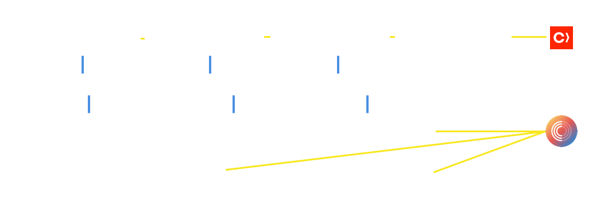

---

# Index

- Context
- Principles
- Advantages
- How to?
- **Open Questions**
- SoundCloud attempt
- Downsides
- Conclusions

---

# Open Questions
## **External Dependencies?**
**RECOMMENDATION :warning:**

- __If CocoaPods for local:__ Use it also for external.
- __If manual setup:__ Use Carthage for checking out external dependencies `carthage update`
  - With the binary.
  - Adding the project to the workspace: `--no-build`

---

# Open Questions
## **Versioning? Git repo per framework?**

**RECOMMENDATION :warning:**
1. Keep it in the same repository *(fast iterations)*
2. Move it once it consolidates. *(sporadic changes)*
3. Then version it! *(snapshots in time)*

---

# Open Questions
## **Static or Dynamic?**

**RECOMMENDATION :warning:**
- `Objective-C` & not shared ~> **Static**
- `Objective-C` && shared ~> **Dynamic**
- `Swift` && `.*` ~> **Dynamic**

> The more dynamic the worse load time

---

# Open Questions
## **Migrate existing project**

**RECOMMENDATION :warning:**
- Start with `Core/Testing`
- Move `Foundation` components down.
- Continue building layers progressively.

*You'll figure out how couple your code is 😂*

---

# Index

- Context
- Principles
- Advantages
- How to?
- Open Questions
- **SoundCloud attempt**
- Downsides
- Conclusions

---

# We **failed** at our first try
## Why?

---

# 1. We didn't version with **CocoaPods**
*I'm not against CocoaPods!*

Local Pods + No versioning + Team = `It Sucks`

---

# 2. __Too many__ frameworks

- No clear responsibilities
- Crossed dependencies
- Messy dependency tree
- Very small responsibilities

---


---


^ Arrows and Core.
^ Tied to ReactiveCocoa
^ Very small frameworks such as Alert, Font, Launcher

---


^ We go with less frameworks.
^ Not that many external dependencies.

---

# Index

- Context
- Principles
- Advantages
- How to?
- Open Questions
- SoundCloud attempt
- **Downsides**
- Conclusions

---

# Lack of documentation
## _(Targets Configuration)_
### __Tip: Use CocoaPods and copy the configuration__

^ Unless you have played a lot with Build Settings it's not a straightforward process.
^ You'll get some errors, missing symbols, unrecognized components and you don't know why.
^ If you know about it, go ahead with a manual process.
^ If you don't there's a trick which is based on using CocoaPods.

---

# Storyboards/Xibs in Frameworks
# __Sucks 😥__
### __Tip 1: Keep them in the application target__
### __Tip 2: Reuse UI only if it's in code__


---

# Frameworks code recognition
# __Sucks even more 😭__

---

# Index

- Context
- Principles
- Advantages
- How to?
- Open Questions
- SoundCloud attempt
- Downsides
- **Conclusions**

---

# **Very time-saver**
## for multi-platform projects

---

#  Helps with **less coupled** code
### *(defined boundaries)*

---

# Setup requires some
## **Xcode Build Settings knowledge**
### *Unless you use CocoaPods*

---

# **Minimize** external dependencies (KISS)
### _(avoid more than 2 levels)_

---

# Use your **commonsense**
## _When deciding the Frameworks you need_
### _(don't get inspired from Javascript)_

- Try to have only those that you really need.

---

# **Configuration** depends on your project
- New project?
- Existing project to migrate?
- Many external dependencies?
- Not that many?
- Already using CocoaPods?
- How many people in your team?

---

# __References__

- [**Library Oriented Programming**: Justin Spahr-Summers](https://realm.io/news/justin-spahr-summers-library-oriented-programming/)
- [**The Unofficial Guide to xcconfig files**](https://pewpewthespells.com/blog/xcconfig_guide.html)
- [**CocoaPods**](https://cocoapods.org)
- [**Carthage**](https://github.com/carthage)
- [**Static & Dynamic libraries**](https://pewpewthespells.com/blog/static_and_dynamic_libraries.html)
- [**Creating your first iOS Framework**](https://github.com/pepibumur/framework-oriented-programming)
- [**pepibumur/framework-oriented-programming**](https://github.com/pepibumur/framework-oriented-programming)

---

# __Thanks__
## Questions? :grinning:
__pepibumur - pepibumur@gmail.com__
[SpeakerDeck Slides: http://bit.ly/22m4lwi](http://bit.ly/22m4lwi)
